# README

> Marketing Cloud Learning Apps are free to use but are not official Salesforce Marketing Cloud products and should be considered community projects. These apps are not officially tested or documented. For help on any Marketing Cloud Learning App, please consult the Salesforce message boards or the issues section of this repository. Salesforce Marketing Cloud support is not available for these applications.

Please make sure you are always using the latest SDK. The Learning App only supports versions 4.4.0 and above.

1. [About](#0001)

    1. [Marketing Cloud App Center](#0002)

    2. [Push Notifications](#0003)

    3. [Subscriber Key](#0004)

    4. [Tags](#0005)

    5. [Geofence and Beacon Messages](#0006)

    6. [Analytics](#0006b)

2. [Implementation on iOS](#0017)

    1. [Prerequisite Steps](#0018)

        1. [iOS Provisioning Panel](#0019)

        2. [Create your apps in the App Center](#0020)

            1. [Add app to App Center](#0021)

            2. [Integrate App Center app](#0022)

    2. [Implementing the SDK Push Notifications](#0023)

    3. [Subscriber Key Implementation](#0024)

    4. [Tag Implementation](#0025)

    5. [Beacon and Geofence Message Implementation](#0026)

    6. [Implement Analytics in your Mobile App](#0026b)

<a name="0001"></a>
# About

This project provides a template for creating a mobile app (for iOS) that uses the Journey Builder for Apps SDK.  It is also a UI for exploring its features and provides a mechanism to collect and send debugging information to learn about the workings of the SDK as you explore.

The code in this repository includes all of the code used to run the fully functional APK, including an App ID and Access Token to let you test and debug the application. These keys will trigger an hourly automated push message of a timestamp, indicating that the application is properly set up. To create a new app the following keys must be set with your own values within the corresponding file.

**AppDelegate+ETPushConstants.m**

1. `kETAppID_Prod`: the App ID for your development app as defined in the App Center section of the Marketing Cloud.

2. `kETAccessToken_Prod`: the Access Token for your development app as defined in the App Center section of the Marketing Cloud.

Note: You can use different keys for the staging/testing phase and the production phase.  Staging/testing keys are called `kETAppID_Debug` and `kETAccessToken_Debug`.
<a name="0002"></a>
## Marketing Cloud App Center

App Center is the central development console for using Fuel’s APIs and building Marketing Cloud apps.

In order to connect your app to the Marketing Cloud, you must first create a MobilePush app in the App Center. 

Each app in App Center represents an application connected to the Marketing Cloud. App Center currently manages four types of connected apps:

* *API Integration* allows you to leverage the Marketing Cloud APIs. Create an API Integration app when you want to use Fuel APIs to automate tasks or integrate business systems. API Integration apps utilize an OAuth2 client credentials flow to acquire access tokens directly from the Fuel authentication service.

* *Marketing Cloud apps* are apps that live within the Salesforce Marketing Cloud and launch via the Marketing Cloud app menu. Marketing Cloud apps include custom apps built by your organization or apps installed from the Salesforce Marketing Cloud HubExchange. Marketing Cloud apps utilize a JSON Web Token (JWT) to acquire access tokens on behalf of logged-in users.

* *Application Extensions* allow you to extend the Marketing Cloud with custom Journey Builder activities, Cloud Editor Blocks, and Automation Studio activities.

* *MobilePush apps* are apps built for the iOS, Android, or Blackberry mobile platforms that use MobilePush to communicate with their users via push messages. The Salesforce Marketing Cloud classifies MobilePush apps as consumer-grade applications and utilize long-lived limited-access tokens.

If you haven’t already, you should [create an App Center account](https://appcenter-auth.exacttargetapps.com/create).

If you have an App Center account, you can [log in to that account](https://appcenter-auth.exacttargetapps.com/redirect).
<a name="0003"></a>
## Push Notifications

MobilePush lets you create and send targeted push messages based on cross-channel consumer data to encourage app usage and deliver increased ROI.  With MobilePush, you view how users navigate through your app. Because MobilePush is built on the Salesforce Marketing Cloud, you can easily integrate push message campaigns with any email, SMS, or social campaign.
<a name="0004"></a>
## Subscriber Key

A subscriber is a person who has opted to receive communications from your organization. 

A valid email address is required to receive emails, and a valid phone number is required to receive SMS messages. You can track additional information about subscribers using profile and preference attributes.

The Subscriber Key identifies your subscribers.

It can be set to a specific value provided by the subscriber, such as a phone number, email address, or other appropriate value. It must be a value that you choose that identifies a unique person. The model here is that one subscriber may have multiple devices. For example, Kevin has 3 devices. The subscriber key identifies Kevin, not his 3 devices. 

Keep in mind that the Marketing Cloud web UI utilizes a send-by-subscriber model. This means:

* The subscriber key is used to identify the devices that will be sent to. This means, if you create a filtered list based on an attribute, it will identify the subscribers who own the devices that have the selected attributes and send to all devices owned by that contact. 
* The Subscriber key is not required, but it is strongly recommended. 

The Salesforce Marketing Cloud interface, as well as the Fuel REST API, support functionality for subscribers identified with a subscriber key.
<a name="0005"></a>
## Tags

Tags let you implement contact segmentation on a per-device level. Additionally, use tags to collect information from the mobile app for unstructured data or data that can contain many potential unknown values. For example, you can use tags when the number of potential attribute names exceeds the number of potential values of an individual attribute, such as the favorite brand specified by a contact. Note that tags are device specific, but one-way. Each device has its own set of tags, but a new device will not pull down tags from the Marketing Cloud. If you create a filtered list based on tag data, be aware that sending from the UI will result in sending to all devices owned by subscribers that have any device with that tag.

<a name="0006"></a>
## Beacon and Geofence Messages

You can use the location capabilities of the *JB4A SDK* to target messages to contacts in selected geographic locations. The SDK pre-downloads geofence messages and triggers those messages when a mobile device crosses a geofence boundary. Note that the message must pre-exist on the device before the device crosses the geofence or encounters a beacon. These messages are downloaded whenever:

* The application is brought to the foreground / started.
* The device moves across the "magic" geofence. The "magic" fence is a geofence with a radius of 5K, and a center point  set to the last-known GPS fix. If the device moves outside that magic fence, the OS will notify the SDK, and the SDK will search for new geofences and beacons to monitor, along with messages for those fences and beacons.

For beacon messages, the app triggers these messages when a mobile device comes into proximity with a known beacon. To use this functionality:

1. The account must have access to both MobilePush and Location Services.

2. You must receive user permission to implement location services.

<a name="0006b"></a>
## Analytics

Mobile Application Analytics enables marketers to gather mobile app actions and behaviors from users and provides powerful visualizations of the data. The data helps you make informed decisions about how to structure your customer journeys, design your client-facing experiences, and tailor your digital marketing campaigns. The collected data is also available inside the Salesforce Marketing Cloud, ready to be used to segment messaging lists, provide highly personalized messaging content, and drive 1:1  custom Journeys.

<a name="0017"></a>
# Implementation on iOS

<a name="0018"></a>
## Prerequisite Steps

1. iOS Provisioning Panel

2. Create your apps in the App Center

<a name="0019"></a>
### iOS Provisioning Panel

You must provision your mobile app in the iOS Provisioning Panel. The certificates issued in the process remain valid for one year. Ensure that you repeat this procedure once per year before your certificates expire to maintain app functionality. Follow the instructions below to integrate the most recent version of the Journey Builder for Apps SDK with your iOS mobile app.

1. Log in at the iOS Dev Center.

2. Click Certificates, Identifiers & Profiles.

    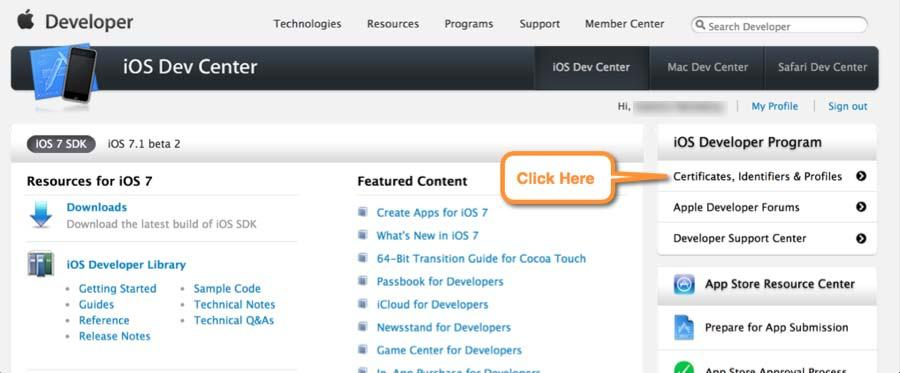

3. Click Identifiers.

    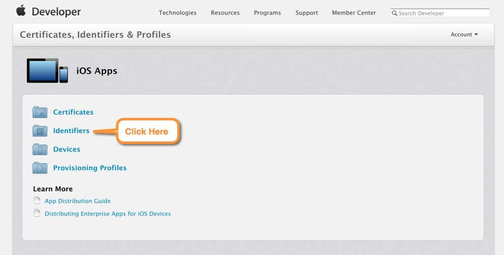

4. Click the + icon to create a new app.

    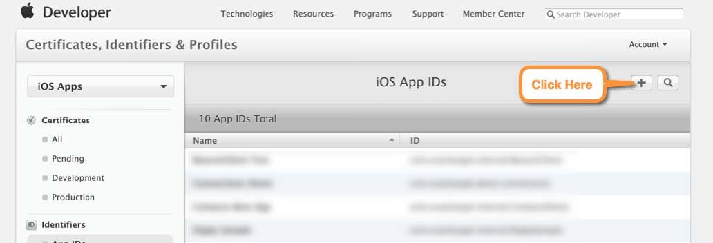

5. Enter a name for the app in the Name text field.

    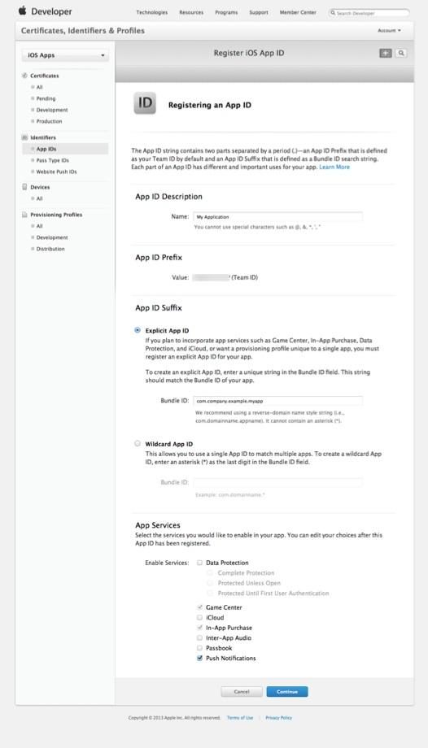

6. Enter an explicit app ID in the Bundle ID field.

7. Click the checkbox next to Push Notifications.

8. Click Continue.

9. Click Submit to confirm your app ID creation.

10. Select your app in the presented list.

    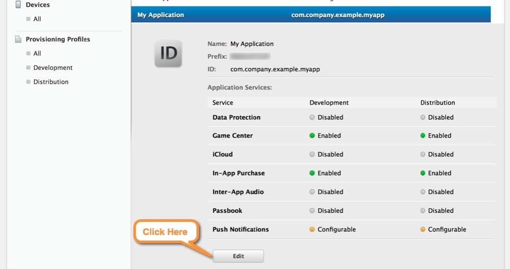

11. Click Edit.

12. Click Create Certificate... under Development SSL Certificate or Production SSL Certificate, depending on the instance of the app you provision. Note that you must repeat these steps for both the development and production instances of this app.

    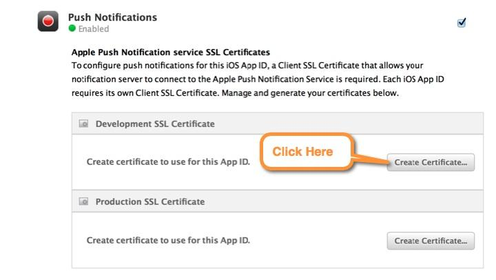

13. Launch Keychain Access on your Mac.

    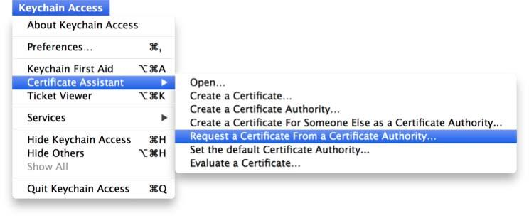

14. Click Keychain Access.

15. Click Certificate Assistant.

16. Click Request a Certificate from a Certificate Authority...

17. Enter your email address in the User Email Address field.

    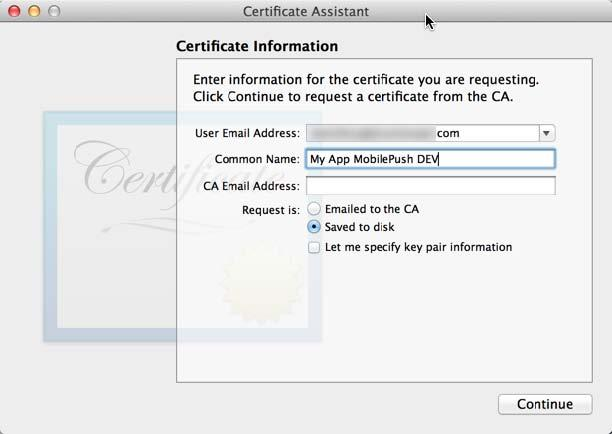

18. Enter a recognizable name for the certificate in the Common Name field.

19. Click Saved to disk.

20. Click Continue.

21. Enter a filename for the saved certificate.

    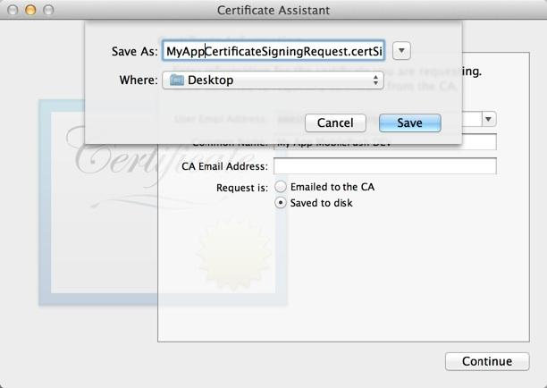

22. Choose a location at which to save the certificate.

23. Click Save.

24. Return to the iOS Dev Center website.

25. Click Continue.

    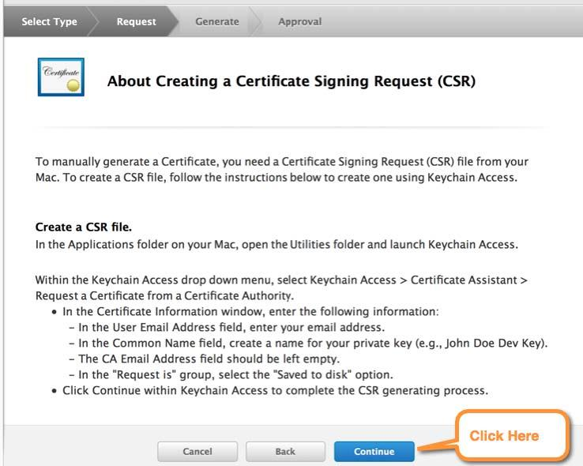

26. Click Choose File.

27. Select the file saved in step 23.

    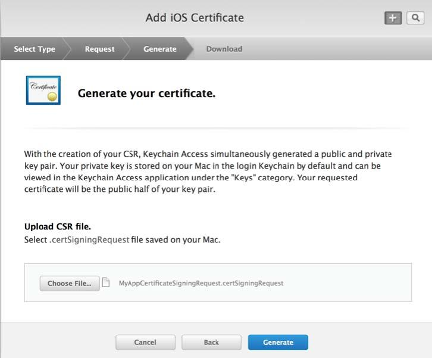

28. Click Generate.

29. Click Download.

    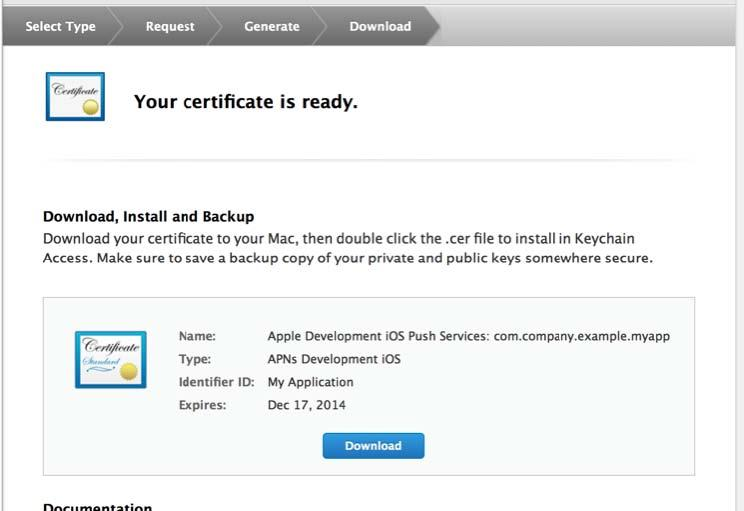

30. Double-click the downloaded file to install the certificate in Keychain Access.

31. Select the certificate in Keychain Access.

    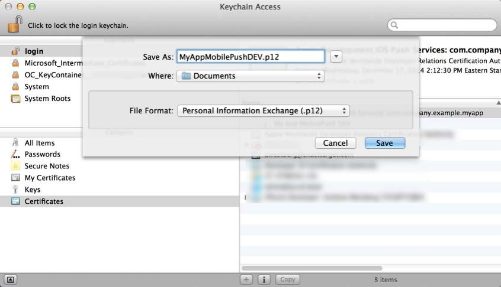

32. Right-click the certificate.

33. Select Export. Ensure that you select only the certificate entry when exporting your certifications. Selecting multiple lines for export will cause an upload failure. Ensure that you do not export the certificate as an embedded key.

34. Select a location in which to save the certificate.

35. Click Save.

36. Optionally, enter a password in the Password field.

    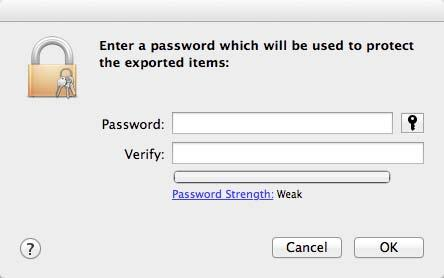

37. If you entered a password, enter that password again in the Verify field.

38. If you entered a password, click OK.

39. Use the production and development certificates (the .p12 files) created in the previous steps along with the passwords to add to your MobilePush app in the the *Create your apps in the App Center* step.

<a name="0020"></a>
### Create your apps in the App Center

In order to connect your app to your Marketing Cloud account, you must follow these steps:

1. Add app to App Center.

2. Integrate the App Center app to your Marketing Cloud account.

3. Add the Provisioning info created in the iOS Dev Center to the app in the App Center.

<a name="0021"></a>
#### Add app to App Center

To create a new MobilePush app:

1. [Log in to the App Center](https://appcenter-auth.exacttargetapps.com/redirect). ([Create an account](https://appcenter-auth.exacttargetapps.com/create), if necessary.)

2. Create a new app and select the MobilePush template

    

3. Fill in, at a minimum, the mandatory fields in this form.

    

    *Depending on your setup, repeat this process if you plan on using different instances for production and development.*

    Note the following about the required fields:

      1. The **Name** can be anything you choose.

      2. The **Package** has no correlation to anything outside of the MarketingCloud ecosystem and can be **any** unique identifier for your application.

      3. The **Description** and **MobilePush Icon** fields are optional but will help you identify your application within your Marketing Cloud account. 

4. Click **Next** in order to integrate this new app with your Marketing Cloud account.

<a name="0022"></a>
#### Integrate App Center app

The MobilePush app created in the App Center must be connected to a specific Marketing Cloud account. You must have login credentials for your Marketing Cloud account in order to connect this MobilePush app to the correct Marketing Cloud account.

Follow these steps in order to connect this MobilePush app to the correct Marketing Cloud account:

1. Select an account (or New…) in the **Account** drop-down.

    

2. Select the **Production ExactTarget Account** button *unless otherwise instructed by your Salesforce Marketing Cloud relationship manager*.

3. Click **Link to Account**.

    A popup window (pictured below) will appear.

    

    In an Enterprise 2.0 account, ensure that you select the correct business unit for your app integration.

4. Click **Integrate**.

5. In the APNS Client section, click **Choose File** and upload the APNS certificate that was provided when you created your app in the[ iOS Dev Center](https://developer.apple.com/devcenter/ios/).

6. Type in the APNS certificate password in the **Password** field.

    

7. When you have all the fields required for your application’s platform(s) populated, click *Next*.

8. Review the information you provided, check for any errors, and click **Finish**.

    You should be presented with a *Success!* message and an application details screen. You can edit any of the areas by clicking the edit icon associated with the **Summary** or **Application Provisioning** sections.

    

<a name="0023"></a>
## Implementing the SDK Push Notifications

> The SDK supports iOS 8, 9, and 10 notifications.

**AppDelegate+ETPushConstants.m**

The SDK can now be configured with the App ID and Access Token, as explained in the *About* section.  Update `kETAppID_Prod` and `kETAccessToken_Prod` with their respective values.

**AppDelegate+ETPush.m**

The boolean parameters `withAnalytics`, `andLocationServices`, `andProximityServices`, `andCloudPages`, and `withPIAnalytics` enable certain functionalities of the SDK; however, they are not required for the push notifications themselves to function. Push notifications will still be sent even if all are set to `NO`.

[view the code](/LearningAppIos/MarketingCloud/AppDelegate%2BETPush.m#L29-L36)
```objective-c
successful = [[ETPush pushManager] configureSDKWithAppID:kETAppID_Debug             // Configure the SDK with the Debug App ID
                                              andAccessToken:kETAccessToken_Debug       // Configure the SDK with the Debug Access Token
                                               withAnalytics:YES                        // Enable Analytics
                                         andLocationServices:YES                        // Enable Location Services (Geofence Messaging)
                                        andProximityServices:YES                        // Enable Proximity services (Beacon Messaging)
                                               andCloudPages:YES                        // Enable Cloud Pages
                                             withPIAnalytics:YES                        // Enable WAMA / PI Analytics
                                                       error:&error];
```

If the configuration is successful and returns YES, the push notifications are registered.

[view the code](/LearningAppIos/MarketingCloud/AppDelegate%2BETPush.m#L80-L87)
```objective-c
UIUserNotificationSettings *settings = [UIUserNotificationSettings settingsForTypes:
                                        UIUserNotificationTypeBadge |
                                        UIUserNotificationTypeSound |
                                        UIUserNotificationTypeAlert
                                                                         categories:nil];
        
[[ETPush pushManager] registerUserNotificationSettings:settings];
[[ETPush pushManager] registerForRemoteNotifications];
…
[[ETPush pushManager] applicationLaunchedWithOptions:launchOptions];
```
If the configuration is unsuccessful, an error message is shown:

[view the code](/LearningAppIos/MarketingCloud/AppDelegate%2BETPush.m#L65-L69)
```objective-c
dispatch_async(dispatch_get_main_queue(), ^{
    /**
     Something has failed in the configureSDKWithAppID call - show error message
     */
    [[[UIAlertView alloc] initWithTitle:NSLocalizedString(@"Failed configureSDKWithAppID!", @"Failed configureSDKWithAppID!")
                                message:[error localizedDescription]
                                elegate:nil
                      cancelButtonTitle:NSLocalizedString(@"OK", @"OK")
                      otherButtonTitles:nil] show];
});
```
Check the error object for detailed failure info. See file PushConstants.h for codes.

<a name="0024"></a>
## Subscriber Key Implementation

To update the subscriber key, you should create a feature for the user to introduce a value, and then set this new value in the pushManager.

**MCSubscribeKeyViewController.m**

To get the subscriber key, use the following snippet. (You can assign this value to any variable.)

[view the code](/LearningAppIos/MarketingCloud/MCSubscribeKeyViewController.m)
```objective-c
self.subscriberKey.text = [[ETPush pushManager] getSubscriberKey];
```
To set the subscriber key, use the following snippet (substitute `self.subscriberKey.text` with the appropriate value):

[view the code](/LearningAppIos/MarketingCloud/MCSubscribeKeyViewController.m)
```objective-c
[[ETPush pushManager] setSubscriberKey:self.subscriberKey.text];
```
<a name="0025"></a>
## Tag Implementation

To implement contact segmentation by tags, include code to set tags for subscriptions as defined by user choice.

**MCTagsViewController.m**

To add a tag:

[view the code](/LearningAppIos/MarketingCloud/MCTagsViewController.m)
```objective-c
[[ETPush pushManager] addTag:@"tag"];
```
To remove a tag:

[view the code](/LearningAppIos/MarketingCloud/MCTagsViewController.m)
```objective-c
[[ETPush pushManager] removeTag:@"tag"];
```
To get all the tags:

[view the code](/LearningAppIos/MarketingCloud/MCTagsViewController.m)
```objective-c
NSSet *setOfTags = [[ETPush pushManager] getTags];
```

<a name="0026"></a>
## Beacon and Geofence Message Implementation

**AppDelegate+ETPush.m**

To implement location services, pass a `YES` value for the `andLocationServices` parameter and use `ETLocationManager` to monitor location and geofence for a user.

[view the code](/LearningAppIos/MarketingCloud/AppDelegate%2BETPush.m#L29-L36)
```objective-c
successful = [[ETPush pushManager] configureSDKWithAppID:kETAppID_Debug             // Configure the SDK with the Debug App ID
                                              andAccessToken:kETAccessToken_Debug       // Configure the SDK with the Debug Access Token
                                               withAnalytics:YES                        // Enable Analytics
                                         andLocationServices:YES                        // Enable Location Services (Geofence Messaging)
                                        andProximityServices:YES                        // Enable Proximity services (Beacon Messaging)
                                               andCloudPages:YES                        // Enable Cloud Pages
                                             withPIAnalytics:YES                        // Enable WAMA / PI Analytics
                                                       error:&error];
```
Make sure you also add the "NSLocationAlwaysUsageDescription" key to your application’s *.plist file. See docs: [NSLocationAlwaysUsageDescription](https://developer.apple.com/library/ios/documentation/General/Reference/InfoPlistKeyReference/Articles/CocoaKeys.html#//apple_ref/doc/uid/TP40009251-SW18) and [NSLocationUsageDescription](https://developer.apple.com/library/ios/documentation/General/Reference/InfoPlistKeyReference/Articles/CocoaKeys.html#//apple_ref/doc/uid/TP40009251-SW27).

After push notifications are registered, start watching locations to retrieve the fence and location notifications from ET Geofences and Beacons:

[view the code](/LearningAppIos/MarketingCloud/AppDelegate%2BETPush.m#L89-L102)
```objective-c
/**   
 Start geoLocation
 */
[[ETLocationManager sharedInstance] startWatchingLocation];
        
/**
 Begins fence retrieval from ET of Geofences.
 */
[ETRegion retrieveGeofencesFromET];
        
/**
 Begins fence retrieval from ET of Beacons.
 */
[ETRegion retrieveProximityFromET];
```
When the application enters background mode, Location Services are disabled through the MobilePush SDK.

[view the code](/LearningAppIos/MarketingCloud/AppDelegate%2BETPush.m#L159-L164)
```objective-c
- (void)applicationDidEnterBackground:(UIApplication *)application {
    /**
     Use this method to disable Location Services through the MobilePush SDK.
     */
    [[ETLocationManager sharedInstance]startWatchingLocation];
}
```
When the application becomes active, Location Services are initiated through the MobilePush SDK.

[view the code](/LearningAppIos/MarketingCloud/AppDelegate%2BETPush.m#L166-L171)
```objective-c
- (void)applicationDidBecomeActive:(UIApplication *)application {
    /**
     Use this method to initiate Location Services through the MobilePush SDK.
     */
    [[ETLocationManager sharedInstance]stopWatchingLocation];
}
```
**MCGeoLocationViewController.m**

To check if locations are active, use the boolean method:

[view the code](/LearningAppIos/MarketingCloud/MCGeoLocationViewController.m#L34)
```objective-c
self.geoLocationNotification.on = [[ETLocationManager sharedInstance]getWatchingLocation];
```
If locations are active it returns `YES`, otherwise it returns `NO`.

To obtain the monitored regions, use this method:

[view the code](/LearningAppIos/MarketingCloud/MCGeoLocationViewController.m#L59)
```objective-c
NSArray *monitoredRegions = [[[ETLocationManager sharedInstance] monitoredRegions] allObjects];
```

<a name="0026b"></a>
## Implement Analytics in your Mobile App

**AppDelegate+ETPush.m**

In the call to `configureSDKWithAppID`, pass a `YES` value for the `withAnalytics` parameter.

[view the code](/LearningAppIos/MarketingCloud/AppDelegate%2BETPush.m#L29-L36)
```objective-c
successful = [[ETPush pushManager] configureSDKWithAppID:kETAppID_Debug             // Configure the SDK with the Debug App ID
                                              andAccessToken:kETAccessToken_Debug       // Configure the SDK with the Debug Access Token
                                               withAnalytics:YES                        // Enable Analytics
                                         andLocationServices:YES                        // Enable Location Services (Geofence Messaging)
                                        andProximityServices:YES                        // Enable Proximity services (Beacon Messaging)
                                               andCloudPages:YES                        // Enable Cloud Pages
                                             withPIAnalytics:YES                        // Enable WAMA / PI Analytics
                                                       error:&error];
```

To see your new Web and Mobile Analytics, open the Web and Mobile Analytics app within the Marketing Cloud and agree to the Terms and Conditions to get started.

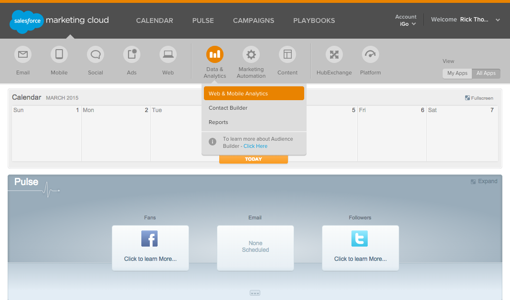